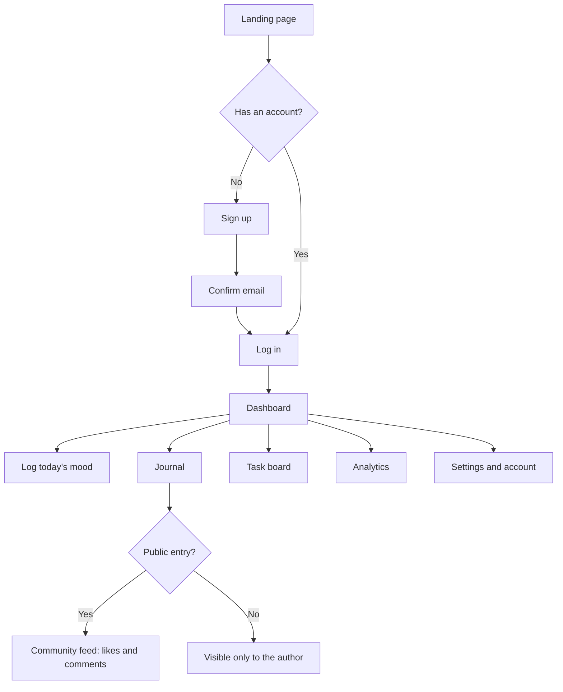
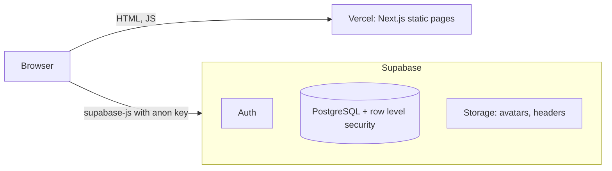
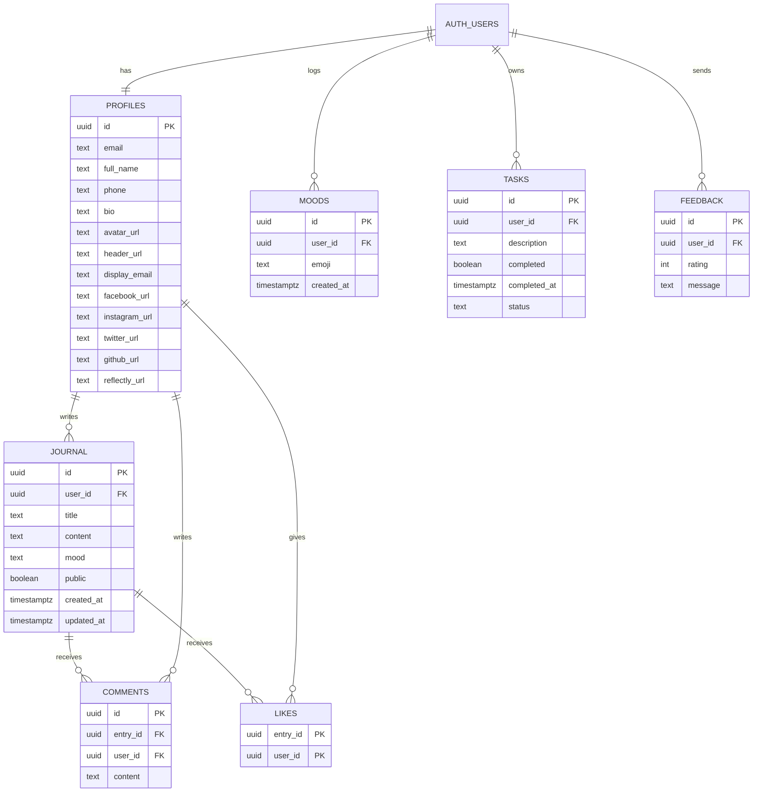

# Hiraya — Project Documentation

> **Status:** Implemented and in testing, preparing for public deployment on Vercel.
> Originally built in July 2025 by the ZAMDevs team as *Reflectly*, renamed to *Muni* in September 2026, then to *Hiraya*.
> Diagrams are written in [Mermaid](https://mermaid.js.org/) and render directly on GitHub.

## Table of Contents
1. [Feature Information](#1-feature-information)
2. [Project Information](#2-project-information)
3. [Overview](#3-overview)
4. [User Flow](#4-user-flow)
5. [Features Breakdown](#5-features-breakdown)
6. [Core Concepts](#6-core-concepts)
7. [System Architecture](#7-system-architecture)
8. [Design System](#8-design-system)
9. [Data Model](#9-data-model)
10. [Frontend Architecture](#10-frontend-architecture)
11. [Security](#11-security)
12. [Setup & Configuration](#12-setup--configuration)
13. [Common Tasks](#13-common-tasks)
14. [Known Issues & Caveats](#14-known-issues--caveats)
15. [Change Log](#15-change-log)

---

## 1. Feature Information

| Field | Value |
|-------|-------|
| **Product** | Hiraya, a journaling and mood tracking web app |
| **Name** | Filipino for the fruit of one's hopes and dreams (*hiraya manawari*) |
| **Status** | Implemented, in testing |
| **Primary users** | People who want a private daily journal and mood log |
| **Frontend** | Next.js 15 (Pages Router), React 19, TypeScript, Tailwind CSS |
| **Database** | Supabase PostgreSQL, accessed from the browser with `@supabase/supabase-js` |
| **Auth / Storage** | Supabase Auth (email and password), Supabase Storage (avatars, header images) |
| **Charts** | Recharts |
| **Hosting** | Vercel (app) + Supabase (database, auth, storage) |
| **Architecture style** | Client-rendered single-page app over a hosted backend (no custom API server) |

---

## 2. Project Information

### Repository
| Field | Value |
|-------|-------|
| **Repository** | [github.com/helidastar/Hiraya](https://github.com/helidastar/Hiraya) |
| **Forked from** | [marshmallowdevz/ZAMDevs-new-repo](https://github.com/marshmallowdevz/ZAMDevs-new-repo) |
| **Default branch** | `main` |
| **Documentation** | `docs/DOCUMENTATION.md` (this file), `docs/ONBOARDING.md` |

### Branches
| Branch | Purpose | Status |
|--------|---------|--------|
| `main` | Stable, reviewed work. Deployed to production. **Protected:** changes arrive through pull requests; force-pushes and deletion are blocked. | Active |
| `development` | Integration branch. All feature branches merge here first. | Active |
| `feat/UI` | Pages, components and client-side logic | Active |
| `feat/backend` | Supabase migrations, row level security, database functions | Active |
| `feat/docs` | Documentation | Active |

**Branch flow:** `feat/<area> → development → main`.

### Commit conventions
- One feature or fix per commit.
- Conventional commits in lowercase: `feat(ui): ...`, `fix(auth): ...`, `refactor(settings): ...`, `docs: ...`, `chore: ...`.
- Feature branches merge into `development` with `--no-ff`, titled `merge(<scope>): <summary>`.

### Contributors
| Name | GitHub |
|------|--------|
| Charity Ricabo | [@helidastar](https://github.com/helidastar) |
| Aleyah Jose | [@marshmallowdevz](https://github.com/marshmallowdevz) |
| Maria Mhikyla Jayno | [@mhiksNmatch](https://github.com/mhiksNmatch) |
| Zana Capao | [@zanacapao](https://github.com/zanacapao) |
| Raffy Bonilla | [@raffybonilla](https://github.com/raffybonilla) |

---

## 3. Overview

Hiraya gives each user a private place to write and to notice how they feel over time. A user signs up, logs a mood each day, writes journal entries, and sees their mood patterns on the dashboard and analytics pages. Entries are private unless the user publishes them to the community feed, where other signed-in users can like and comment.

There is no custom backend server. The browser talks to Supabase directly with the public anon key, and **row level security policies in the database decide what each user may read and write** (see [Security](#11-security)).

---

## 4. User Flow



---

## 5. Features Breakdown

| Page | Route | What it does |
|------|-------|--------------|
| Landing | `/` | Short introduction, feature list, sign up and log in |
| About | `/about` | About the app |
| Sign up / Log in | `/auth/signup`, `/auth/login` | Email and password auth. The profile row is created on first login |
| Password reset | `/auth/forgot-password`, `/auth/reset-password` | Sends a reset email that opens the reset page |
| Dashboard | `/dashboard` | Welcome, streak, today's mood, month calendar, mood chart, recent activity, monthly report |
| Journal | `/dashboard/journal` | Entries with title, date, mood, public or private, undo and redo |
| Mood tracker | `/dashboard/mood` | Pick today's mood, see advice and full mood history |
| Tasks | `/dashboard/task` | Drag-and-drop Kanban board |
| Analytics | `/dashboard/analytics` | Moods and entries per day, and summaries for today, week, month and overall |
| Community feed | `/feed` | Public entries with likes, comments and share. Authors can edit or delete their own |
| Settings | `/dashboard/settings` | Dark mode, rating, feedback, legal pages, change password, log out |
| Account | `/dashboard/account` | Profile picture, header, name, bio, social links, delete account |

---

## 6. Core Concepts

### Moods
All moods come from one list in `src/components/moods.tsx`: thirteen moods, each with a label, a score from 1 (lowest) to 5 (happiest), a line-art face icon and a short piece of advice. The UI never shows emojis.

The value stored in the database is still an emoji character (`moods.emoji`, `journal.mood`) so moods saved by earlier versions keep working. Older values that are no longer in the list are mapped to the closest current mood by `getMood()`.

### One mood per day
A user logs at most one mood per day. `src/lib/moodLog.ts` enforces this: saving a mood deletes any mood already logged for that day, then inserts the new one. The dashboard calendar and the mood tracker both use it.

### Local dates
Dates are calculated in the user's own timezone with `src/lib/dates.ts`. Using `toISOString()` (UTC) would put anything logged before 8am in the Philippines on the previous day. Today's moods and entries store the current time; back-dated ones store local noon.

### Public and private entries
Entries are private by default. Only public entries appear in the community feed, and only the author can edit or delete an entry.

---

## 7. System Architecture



Every page is pre-rendered as static HTML and then loads its data in the browser. Vercel only serves files; all data access goes through Supabase.

---

## 8. Design System

| Token | Value | Use |
|-------|-------|-----|
| Primary | `#A09ABC` | Buttons, headings, icons |
| Secondary | `#B6A6CA` | Gradients, hover states |
| Light | `#D5CFE1`, `#E1D8E9` | Backgrounds, borders |
| Accent | `#D4BEBE` | Background gradients |
| Text | `#6C63A6` | Body text |
| Dark background | `#1a1a2e`, `#23234a` | Dark mode |

Icons come from `react-icons` (Font Awesome set). Mood faces use the Font Awesome regular face icons. Dark mode is a `dark` class on `<html>`, stored in `localStorage` (`src/components/DarkModeContext.tsx`).

---

## 9. Data Model

Migrations live in `supabase/migrations/` and run in filename order.



`profiles.reflectly_url` keeps its original column name for compatibility; the UI labels it "Hiraya".

| Migration | Contents |
|-----------|----------|
| `20250707000000_base_schema.sql` | Tables, indexes, storage buckets (reconstructed for new projects) |
| `20250708000000_profile_display_email.sql` | `profiles.display_email` |
| `20250709000000_profile_social_links.sql` | Social link columns |
| `20260927000000_row_level_security.sql` | Row level security for every table and for storage uploads |
| `20260927000100_likes.sql` | `likes` table and policies |
| `20260927000200_feedback.sql` | `feedback` table and policies |
| `20260927000300_delete_own_account.sql` | `delete_own_account()` function |

---

## 10. Frontend Architecture

```
src/
  pages/
    _app.tsx              Providers, page transition overlay, toasts
    _document.js          Fonts
    index.tsx             Landing page
    about.tsx, privacy.tsx, terms.tsx, cookies.tsx
    feed.tsx              Community feed
    auth/                 signup, login, logout, forgot-password, reset-password
    dashboard/            index, journal, mood, task, analytics, settings, account
  components/
    Sidebar.tsx           Navigation
    Modal.tsx, LegalModal.tsx
    DarkModeContext.tsx   Dark mode state
    moods.tsx             Mood list, labels, scores, icons
    MoodPicker.tsx        Mood selector for the journal editors
  lib/
    supabaseClient.ts     Supabase client from environment variables
    dates.ts              Local date keys, day bounds, timestamps
    moodLog.ts            One-mood-per-day save and clear
  styles/globals.css
```

Pages fetch their own data in `useEffect` and redirect to `/auth/login` when there is no session.

---

## 11. Security

- The anon key in the browser is public by design. **Row level security is what protects user data**, so `20260927000000_row_level_security.sql` must be run on every environment.
- Journal: public entries are readable by signed-in users; private entries only by the author. Only the author can write.
- Moods and tasks: only the owner can read or write.
- Comments and likes: visible on entries the user can see. Comments can be deleted by their author or by the entry's author.
- Storage: users can only upload into their own `<user id>/` folder.
- Account deletion runs as a `security definer` function that only ever deletes the caller's own data.
- Changing the password requires the current password.

---

## 12. Setup & Configuration

See [ONBOARDING.md](ONBOARDING.md) for step-by-step setup and deployment.

| Variable | Purpose |
|----------|---------|
| `NEXT_PUBLIC_SUPABASE_URL` | Supabase project URL. Also allows images from that host in `next.config.ts` |
| `NEXT_PUBLIC_SUPABASE_ANON_KEY` | Supabase public anon key |

| Command | Purpose |
|---------|---------|
| `npm run dev` | Local development server |
| `npm run build` | Production build (run before pushing) |
| `npm start` | Serve the production build |

---

## 13. Common Tasks

**Add a mood.** Add an entry to `MOODS` in `src/components/moods.tsx` with a new `value`, label, score, icon and advice. Every picker, chart and label updates automatically.

**Add a page.** Create a file under `src/pages/`. Add it to `menuItems` in `src/components/Sidebar.tsx` if it belongs in the navigation.

**Change the database.** Add a new file to `supabase/migrations/` with a later timestamp, make it safe to run twice (`if not exists`, `drop policy if exists`), run it in the SQL editor, and add row level security for any new table.

**Read feedback and ratings.** Open the `feedback` table in the Supabase table editor.

---

## 14. Known Issues & Caveats

| Issue | Notes |
|-------|-------|
| Migrations not yet verified on the original database | The row level security and new tables were written against the schema the code uses. Run them and test sign-up, journal, feed and account deletion before going public |
| Profile details are visible to signed-in users | Any signed-in user can read other users' profile rows, including phone and email. Moving private fields to a separate table would fix this |
| Uploaded images remain after account deletion | Supabase does not allow deleting storage files from SQL. Remove them from the dashboard or add a server function |
| Profile rows are created on first login | With email confirmation on, sign-up has no session, so the profile is inserted at first login instead |
| The "All" and "Recent" feed filters are the same | Both sort newest first. "Popular" sorts by likes |
| Styling mixes Tailwind and inline styles | Journal and feed editors use inline styles; consolidating them into Tailwind would simplify theming |
| ESLint is skipped during builds | `eslint.ignoreDuringBuilds` is on in `next.config.ts` |

---

## 15. Change Log

### September 2026: Hiraya
- Renamed from Muni to Hiraya.

### September 2026: Muni
- Renamed from Reflectly to Muni. Forked to `helidastar/Muni` (now `helidastar/Hiraya`).
- Supabase config moved to environment variables. Row level security added for every table and storage.
- Fixed: new sign-ups saw "already registered", password reset links went to the login page, the dashboard "New Entry" button led to a 404, journal entries lost their title, mood and date, moods landed on the wrong day before 8am, duplicate moods per day, analytics "Today" never counted today, a case-sensitive image path, and an empty page that broke production builds.
- Journal entries are private by default.
- Emojis replaced with icons and text labels. One shared mood list and mood picker.
- Likes, ratings and feedback are saved. Users can delete their account. The notification toggle that did nothing was removed.
- Source moved into `src/`. SQL organized as ordered migrations. Unused dependencies removed.

### July 2025: Reflectly
- Original ZAMDevs team project.
